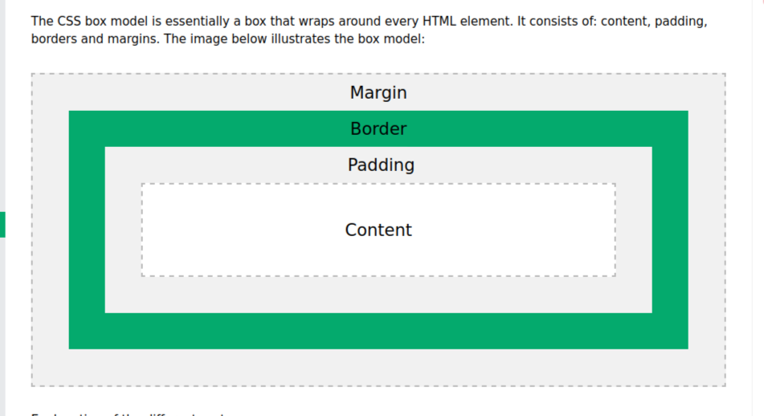

<!-- START doctoc generated TOC please keep comment here to allow auto update -->
<!-- DON'T EDIT THIS SECTION, INSTEAD RE-RUN doctoc TO UPDATE -->
**Table of Contents**

- [CSS BOX MODEL](#css-box-model)
  - [Introduction](#introduction)
  - [CSS box model parts](#css-box-model-parts)
  - [example](#example)
  - [Explanation](#explanation)

<!-- END doctoc generated TOC please keep comment here to allow auto update -->

# CSS BOX MODEL

## Introduction

In CSS, the term **box model** is used when talking about *design* and *layout*.It defines the structure and layout of elements on a webpage by conceptualizing each element as a rectangular box.  

Understanding the CSS Box Model is essential for creating well-designed and visually appealing websites.  

This guide aims to provide an overview of the CSS Box Model, its properties, and how it affects the layout of web elements.

## CSS box model parts
The CSS Box Model consists of four main components:  
1. **Content**: The actual content of the element, such as text, images, or other media.
1. **Padding**: The space between the content and the element's border.
1. **Border**: The border surrounding the content and padding.
1. **Margin**: The space between the border and adjacent elements.

The following image illuste



## example
  
index.html
  ```html
  <!DOCTYPE html>
  <html lang="en">
  <head>
  <meta charset="UTF-8">
  <meta name="viewport" content="width=device-width, initial-scale=1.0">
  <title>Everyday Git</title>
  <link rel="stylesheet" href="style.css">
 </head>
 <body>
  <div></div>
  </body>
  </html>
  ```
  style.css
```css
div {
  width: 200px;
  height: 30px;
  padding: 20px;
  border: 10px solid gray;
  margin: 0;
}
```  
## Explanation
This *div* element will have a total width of 260px and a total height of 90px :  

 1. 200px (width of content area) + 40px (left padding + right padding) + 20px (left border + right border)
= 260px (total width)

1. 30px (height of content area) + 40px (top padding + bottom padding) + 20px (top border + bottom border)
= 90px (total height)

The total width of an element should be calculated like this:  

- Total element width = width + left padding + right padding + left border + right border

The total height of an element should be calculated like this:  

- Total element height = height + top padding + bottom padding + top border + bottom border  

## Reference  

For more infomation about css boxmodel [click me](https://www.w3schools.com/css/css_boxmodel.aspF)
